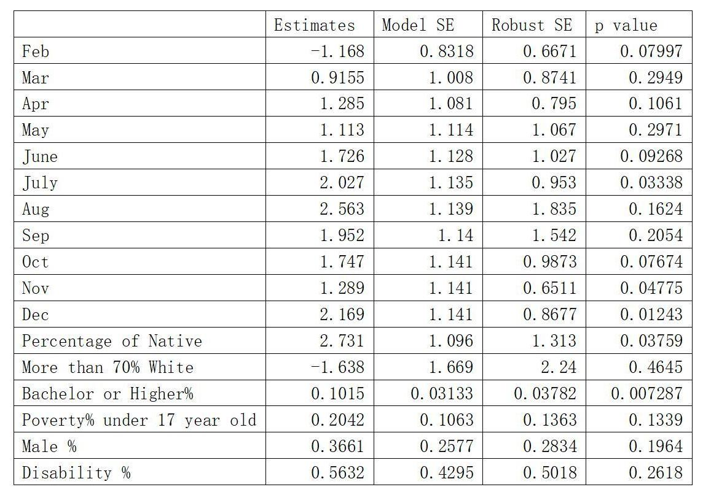
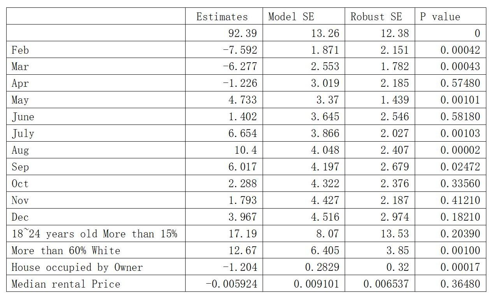

```{r setup, include=FALSE}
knitr::opts_chunk$set(echo = TRUE,message = FALSE, error = FALSE, warning = FALSE)
```

```{r load packages}
library(tidyverse)
library(dplyr)
library(readr)
library(lubridate)
library(ggplot2)
library(geeM)
library(stringr)
library(spdep) #install.packages('spdep')
library(ggpubr)
require(grid)
# packages for map
library(rjson)
library(geojsonsf)
library(sf)
```


# Introduction & Data

Crime and violence experienced by individuals living in a community are important public health issues since people who survived from violent crime may endure not only physical pain and suffering but also mental distress and reduced quality of life. [@McCollister2009] Although according to the FBI and the Bureau of Justice Statistics, violent and property crime rates have shown dramatic declines in the U.S. since the early 1990s when crime spiked across much of the nation, we think people should pay more attention to crime and violence and address these problems as public health issues. As a group of international students living in St.Paul for about three to four years, we are particularly interested analyzing the crime data in the City of St Paul.

To explore and investigate crime rates in Saint Paul, we combined two datasets into our final dataset, the crime incident report released by Saint Paul Police Department for the purpose of more transparent public information and the Minneapolis-Saint Paul Neighborhoods profiles provided by Minnesota Compass, which is a social indicators project that tracks trends in topic areas such as economy and education in the state of Minnesota. The crime incident report records reported incidents from August 14, 2014 through the most recent available in the City of Saint Paul, including the specific neighborhoods and blocks where the incidents happened and the call dispositions for each incident. Different incidents are grouped into 17 types of incidents including “Homicide”, “Rape”, “Robbery”, “Aggravated Domestic Assault”, “Aggravated Assualt”, “Domestic Assaults”, “Criminal Damage”, “Arson”, “Burglary”, “Theft”, “Auto Theft”, “Narcotics”, “Firearm Discharges”, “Community Engagement Event”, “Proactive Police Visit”, “Graffiti”, and “Vandalism”. The Minneapolis-Saint Paul Neighborhoods profiles provide demographic information for the 17 neighborhoods in Saint Paul for the year 2019, including but not limited to the total population,  income level, education level, percentage of different race, and employment status in each of the 17 neighborhoods. 

In this project, we regrouped the 17 types of incidents into five new categories including “Theft”, “Violence”, “Property Damage”, “Police Presence” and “Other”. “Auto Theft” and “Burglary” are classified as “Theft” crimes together with the original “Theft” category because in these crimes, most victims did not experience major personal injuries. We grouped “Homicide”, “Rape”, “Robbery”, “Aggravated Domestic Assault”, “Aggravated Assualt”, “Domestic Assaults”, “Criminal Damage”, and “Arson” are grouped as “Violence” crimes because most of these crimes have force or threat of force involved, and the victims are very likely to experience personal injuries. “Graffiti” and “Vandalism” are classified as “Property Damage” crimes because properties were damaged in most of these cases, and “Community Engagement Event” and “Proactive Police Visit” are classified as “Police Presence” because no actual crimes were committed in most of these cases. Lastly, we grouped “Narcotics” and “Firearm Discharges” as “Other” crimes because having a firearm discharged does not necessarily mean anyone was injured or actual crimes were committed, and discovering narcotics does not fit well into any of the four previous types.  To avoid the impact of COVID-19 pandemic, we chose to focus on studying the reported crime data in 2019. In addition, in this study, we will focus only on the newly defined “Theft” and “Violence” crimes; therefore, we created two new datasets by filtering the final combined data to only theft crimes and only violence crimes and then performed analysis for the two datasets respectively. 


```{r load datasets}
crime <- read_csv("Crime_Incident_Report.csv")

saintpaul <- readr::read_csv("2019_neighborhood_new.csv")

temperature <- read_csv("2019 St.Paul Monthly Temp.csv")

map <- geojson_sf("TwinCities Final.json",expand_geometries = TRUE) %>% 
  mutate(name2 = ifelse(name2 == "Frogtown/Thomas-Dale", "Frogtown",name2),
         name2 = ifelse(name2 == "Highland Park", "Highland",name2),
         name2 = ifelse(name2 == "St Anthony Park", "St. Anthony",name2),
         name2 = ifelse(name2 == "West 7th - Fort Road", "West Seventh",name2))
```

```{r cleaning dataset}
# filter to 2019
crimedataset <- crime %>% 
  filter(year(DATE) == 2019)

crimedataset <- crimedataset %>% 
  mutate(incident_cat = ifelse(str_detect(INCIDENT, "Theft")|INCIDENT %in% c("Burglary") , "Theft",INCIDENT)) %>% 
  mutate(incident_cat = ifelse(str_detect(INCIDENT, "Assault")|INCIDENT %in% c("Arson","Rape","Homicide","Simple Asasult Dom.", "Criminal Damage", "Robbery"), "Violence",incident_cat)) %>% 
  # other: no people hurt
  mutate(incident_cat = ifelse(INCIDENT %in% c("Graffiti" ,"Vandalism"), "Property Damage", incident_cat)) %>%
  mutate(incident_cat = ifelse(INCIDENT %in% c("Narcotics","Discharge"), "Other", incident_cat)) %>% 
  mutate(incident_cat = ifelse(INCIDENT %in% c("Community Engagement Event", "Proactive Police Visit"), "Police Presences", incident_cat))

crimedataset <- crimedataset %>%
  mutate(month = month(DATE)) %>%
  group_by(NEIGHBORHOOD_NUMBER, month,incident_cat) %>% 
  summarise(inc_count = n(),NEIGHBORHOOD_NUMBER,incident_cat,.groups = "drop") %>% 
  distinct() %>% 
  complete(NEIGHBORHOOD_NUMBER,month,incident_cat,fill = list(inc_count = 0)) %>% 
  
  left_join(saintpaul, by = c("NEIGHBORHOOD_NUMBER" = "Neighorhood_Code")) %>% 
  mutate(count_per_10000_people = inc_count/`Total population`*10000) %>% 
  mutate(Neighborhood = ifelse(Neighborhood == "Como (St. Paul)", "Como Park",Neighborhood),
         Neighborhood = ifelse(Neighborhood == "Frogtown/Thomas-Dale", "Frogtown",Neighborhood),
         Neighborhood = ifelse(Neighborhood == "St. Anthony Park", "St. Anthony",Neighborhood),
         Neighborhood = ifelse(Neighborhood == "Battle Creek-Highwood", "Southeast",Neighborhood))

```

```{r}
theftdata <- crimedataset %>% 
  filter(incident_cat == "Theft") %>% 
  pivot_longer(cols= `Male - Share` :`Poverty 65 years and older - Share`,names_to = "variables", values_to = "values") %>% 
  mutate(values = as.numeric(str_remove(values, "%"))) %>% 
  pivot_wider(names_from = variables, values_from = values) %>% 
  mutate(label = ifelse(Neighborhood == "Downtown", "Downtown"," "),
         label = ifelse(Neighborhood == "Union Park", "Union Park", label))

violencedata <- crimedataset %>% 
  filter(incident_cat == "Violence") %>% 
  pivot_longer(cols= `Male - Share` :`Poverty 65 years and older - Share`,names_to = "variables", values_to = "values") %>% 
  mutate(values = as.numeric(str_remove(values, "%"))) %>% 
  pivot_wider(names_from = variables, values_from = values) %>% 
  mutate(label = ifelse(Neighborhood == "Downtown", "Downtown"," "))

mapdata <- violencedata %>% 
  group_by(Neighborhood) %>% 
  summarise(year_count_per10000 = sum(count_per_10000_people), `Unemployment rate - Share`, .groups = "drop") %>%
  distinct() %>% 
  left_join(map, by = c("Neighborhood"="name2")) 
```


# Research Question

In this project, we aim to explore and investigate the social and demographic factors that might contribute to the various monthly reported theft and violence crime rates respectively across the 17 neighborhoods in Saint Paul in 2019. More specifically, we will look at the number of crimes per 10000 people for all neighborhoods to account for different total populations in different neighborhoods. 

As we mentioned in introduction, exposure to crime and violence is an important public health issue as crimes can cause severe consequences for the younger population as children and adolescents exposed to violence are at risk for poor long-term behavioral and mental health outcomes regardless of whether they are victims, direct witnesses, or just hear about the crime. The effects of exposure to violence in childhood may be seen in adulthood and can result in greater risk for substance use, risky sexual behavior, and unsafe driving behavior. [@Brady2006] We chose to focus on theft and violence crimes because theft is one of the most prevalent types of crime while violence crimes can be the most dangerous to public health. It is important to notice that the data we used only includes police reported crimes, which means a large amount of crimes may be omitted and ignored.


# Model Selection

For model selection, we decided to use generalized estimating equations (GEE) to estimate parameters. We choose GEE instead of the OLS model because the OLS standard errors would be wrong unless our data are actually independent. Since we have correlated repeated measures, we don’t have as much information as if they were independent observations; therefore, we think generalized estimating equations can provide us with less biased and more valid inference. In addition, even though our data is heavily involved with spatial locations, we favor GEE over the spatial models (SAR, CAR, etc..) because we have repeated measurements for each neighborhood in Saint Paul over the twelve months, which the spatial models wouldn’t be able to handle. Besides that, the marginal approach of GEE involves fewer assumptions compared to the mixed effect models and does not require knowledge of the ways in which individuals are correlated within a neighborhood nor on how neighborhoods vary because we know the robust standard errors are reliable even if we assume the wrong correlation structure.

For the demographic information that we will use as our explanatory variables, we first visualize their relationships with the outcome that we are interested in, which is the crime counts per capita, and then decide whether to use the explanatory variable as a quantitative or categorical variable in our model. We choose some common demographic information such as percentage of Bachelor’s degree or higher, unemployment rate, median household income, and percentage of different races living in the neighborhood as explanatory variables for both theft and violence crime counts per capita. In addition, we ran a LASSO model as an extra source for providing some potential important explanatory variables from our datasets that we might have omitted.  

Regarding the correlation structure for our GEE model, we think the “ar1” correlation structure is most realistic given our dataset as it assumes the correlation between measurements decays over time. To further validate our intuition, we compared estimating equations with different correlation structures such as “exchangeable” and “independent” correlation structures, and it turns out that “ar1” gives us the model SEs that are closest to the robust SEs given by the GEE model; therefore, we decided to use the “ar1” correlation structure for our GEE model. For the neighborhood structure we will later use for the Moran’s I test to check for spatial independence of the residuals from our models, we choose KNN to illustrate the relationship among all neighborhoods as it allows every neighborhood to be more equally represented , and we set $k = 3$ because we think the illustrated relationship between neighborhoods is closer to the reality compared to other neighborhood structures such as Rook or Queen after we compared visualizations of all neighborhood structures.


### Neighborhood type
```{r}
stpaul_centroids <- st_centroid(st_geometry(mapdata$geometry), of_largest_polygon = TRUE)

KNN <- knn2nb(knearneigh(stpaul_centroids, k = 3))
nb_KNN_net <- nb2lines(nb = KNN, coords = stpaul_centroids, as_sf = TRUE)
Ww_KNN <- nb2listw(KNN, style = "W")

ROOK <- poly2nb(mapdata$geometry,queen = FALSE)
nb_R_net <- nb2lines(nb = ROOK, coords = stpaul_centroids, as_sf = TRUE)
Ww_ROOK <- nb2listw(ROOK, style = "W")

ROOK_map <- stpaul_centroids %>%
  ggplot() + geom_sf() + 
  geom_sf(data = mapdata,aes(geometry = geometry)) + 
  geom_sf(data = nb_R_net)+
  scale_fill_gradient(high = "pink", low = "white") +
  scale_size_continuous(range = c(2,10))+
  theme_void()+
  labs(title = "ROOK")

KNN_map <- stpaul_centroids %>%
  ggplot() + geom_sf() + 
  geom_sf(data = mapdata,aes(geometry = geometry)) + 
  geom_sf(data = nb_KNN_net)+
  scale_fill_gradient(high = "pink", low = "white") +
  scale_size_continuous(range = c(2,10))+
  theme_void()+
  labs(title = "KNN k=3")

ggarrange(ROOK_map, KNN_map, nrow = 1)
```


# Violence Crimes

### Map Visualization

Below is the map visualization we created from our violence crimes dataset to show the crime distribution in the 17 Saint Paul neighborhoods in the year of 2019. From the visualization, we can clearly see that Downtown had the the highest number of reported violence crimes per capita among all 17 neighborhoods in 2019, which is about 200 reported violence crimes for every 10000 people living in the area, and the neighborhoods surrounding Downtown such as Frogtown, Dayton’s Bluff, and Payne-Phalen also had relatively higher number of reported violence crimes per capita compared to other neighborhoods.


```{r violence map,fig.width=8,fig.height=4,warning=FALSE, fig.alt = "This is a choropleth map colored by the violence crime count per capita in Saint Paul neighborhoods."}
mapdata %>% 
  ggplot()+
  geom_sf(aes(geometry = geometry,fill = year_count_per10000)) +
  geom_sf_text(aes(geometry = geometry, label = Neighborhood), size = 3, color = 'black')+
  scale_fill_gradient(high = "red", low = "white") +
  labs(title = "2019 Reported Violence Crime Count per capita in St.Paul Neighborhoods",
       fill = "Crimes Counts per 10000 people") +
  theme_void()+
  theme(plot.title = element_text(size = 15,hjust = 0.5,color = "#414141"),
        legend.title = element_text(size = 15,hjust = 0.7,color = "#414141"),
        legend.position = "bottom",
        legend.justification = c(0.5,0.8))
```


### Violence Variables Visualizations

Below are some visualizations we created for exploring relationships between our explanatory variables and the number of violence crimes per capita. We can see that most of the explanatory variables have linear relationships with violence crime counts per capita, which suggests that these variables can be used as quantitative variables in our model for violence crime counts per capita.

As shown by the visualizations, median household income, unemployment rate, and  poverty rate of 17 years old or younger all seem to have linear relationships with violence crime counts per capita; however, since these three variables are highly correlated to each other, we decide to just include poverty rate of 17 years old or younger as a quantitative variable in the model as it seems to have the strongest linear relationship with the number of violence crimes per capita among the three explanatory variables. In addition, the percentage of male and the percentage of population with a disability both seem to have linear relationships with the number of violence crimes per capita, and the percentage of Bachelor’s degree or higher also seems to have a negative linear relationship with the number of violence crimes per capita, although Downtown seems to be an outlier as it has a relatively high percentage of Bachelor’s or higher degree but still has the highest number of violence crimes per capita among all neighborhoods. 
 
Regarding the relationship between the number of violence crimes per capita and the percentage of different races, our visualizations suggest that the percentage of American Indian or Alaska Native and the percentage of Hispanic or Latino population in the neighborhood seem to have somewhat linear relationships with violence crime counts per capita; however, since the percentage of different races are also highly correlated to each other, we decide to just include the percentage of American Indian or Alaska Native as a quantitative variable in the model as it seems to have a stronger linear relationship with the number of violence crimes per capita compared to the percentage of Hispanic or Latino population. It’s worth noticing that Downtown still seems to be an outlier as it has a relatively low percentage of American Indian or Alaska Native compared to the other neighborhoods but still has the highest number of violence crimes per capita among all 17 neighborhoods. 

Percentages of Asian or Pacific Islander, White, and Black population don’t seem to have clear linear relationships with the number of violence crimes per capita in the neighborhood, so we decide to turn these three variables into categorical variables; however, in order to lessen collinearity between explanatory variables, we decide to just include the percentage of one race among these three variables because although we made these variables categorical, percentage of different races are still correlated to each other. We choose to include the percentage of white population as an explanatory variable in the model because the separation between categories seems to be larger compared to the other two races, and white population also seem to be a more predominant race in the St.Paul neighborhoods as even the neighborhood with the least percentage of white people still has close to 40% of white people among its population, while the neighborhood with the most percentage of white people has more than 80% of white people among its population.

```{r variables-1}
plot_UE <- violencedata %>% 
  mutate(ue_percentage = `Unemployment rate - Share`) %>% 
  group_by(Neighborhood) %>% 
  summarise(total_count = sum(count_per_10000_people), ue_percentage,label) %>% 
  distinct() %>% 
  ggplot(aes(x = ue_percentage/100, y = total_count))+
  geom_text(aes(label = label), size = 2.5, vjust = 2,check_overlap = TRUE)+
  labs(title = "Unemployment rate",  x = "",y = "") +
  geom_point(color = "#414141")+
  geom_smooth(method = 'lm',se = FALSE) +
  scale_x_continuous(labels = scales::percent)+
  theme_classic()+
  theme(plot.title = element_text(size = 12,hjust = 0.5,color = "#414141"))


plot_income <- violencedata %>% 
  mutate(Median_household_income = `Median household income (2008-2012, 2012 dollars)`) %>%
  group_by(Neighborhood) %>% 
  summarise(total_count = sum(count_per_10000_people), Median_household_income,label) %>% 
  distinct() %>% 
  ggplot(aes(x = Median_household_income, y = total_count))+
  geom_text(aes(label = label), size = 2.5, vjust = 2,check_overlap = TRUE)+
  labs(title = "Median household income",  x = "",y = "") +
  geom_point(color = "#414141")+
  geom_smooth(method = 'lm',se = FALSE) +
  theme_classic()+
  theme(plot.title = element_text(size = 12,hjust = 0.5,color = "#414141"))

plot_poverty <- violencedata %>% 
  group_by(Neighborhood) %>% 
  summarise(total_count = sum(count_per_10000_people), `Poverty 17 years and younger - Share`,label) %>% 
  distinct() %>% 
  ggplot(aes(x = `Poverty 17 years and younger - Share`/100, y = total_count))+
  geom_text(aes(label = label), size = 2.5, vjust = 2,check_overlap = TRUE)+
  labs(title = "Poverty rate of 17 years and younger",  x = "",y = "") +
  geom_point(color = "#414141")+
  geom_smooth(method = 'lm',se = FALSE) +
  scale_x_continuous(labels = scales::percent)+
  theme_classic()+
  theme(plot.title = element_text(size = 10,hjust = 0.5,color = "#414141"))

plot_BA <- violencedata %>% 
  mutate(BA_percentage = `Bachelor's degree or higher - Share`) %>% 
  group_by(Neighborhood) %>% 
  summarise(total_count = sum(count_per_10000_people), BA_percentage,label) %>% 
  distinct() %>% 
  ggplot(aes(x = BA_percentage/100, y = total_count))+
  geom_text(aes(label = label), size = 2.5, vjust = 2,check_overlap = TRUE)+
  labs(title = "Percentage of Bachelor's degree or higher", x = "", y = "") +
  geom_point(color = "#414141")+
  geom_smooth(method = 'lm',se = FALSE) +
  scale_x_continuous(labels = scales::percent)+
  theme_classic()+
  theme(plot.title = element_text(size = 10,hjust = 0.7,color = "#414141"))


econ_plot <- ggarrange(ggarrange(plot_poverty, plot_UE, plot_income, plot_BA,
          ncol = 2, nrow = 2))

annotate_figure(econ_plot, left = textGrob("Crime Count per 10000 people", rot = 90, vjust = 1, gp = gpar(cex = 1)))
```

```{r race variables}
plot_Black <- violencedata %>% 
  mutate(black_percentage = `Black or African American - Share`,
         black = ifelse(black_percentage <= 10, "Less than 10%", NA),
         black = ifelse(black_percentage >10 & black_percentage <= 20, "Between 10% & 20%",black),
         black = ifelse(black_percentage > 20, "More than 20%", black)) %>%
  group_by(Neighborhood) %>% 
  summarise(total_count = sum(count_per_10000_people), black_percentage, black,label) %>% 
  distinct() %>% 
  ggplot(aes(x = black_percentage/100, y = total_count, color = black))+
  labs(title = "Black or African American", x = "", y = "") +
  geom_boxplot(varwidth = TRUE,outlier.alpha = 0)+
  geom_point(size = 1.2)+
  geom_text(aes(label = label), size = 2.5, vjust = 0.3, hjust = 1.1, check_overlap = TRUE)+
  scale_x_continuous(labels = scales::percent)+
  #geom_smooth(method = 'lm') +
  theme_classic()+
  theme(plot.title = element_text(size = 11,hjust = 0.5,color = "#414141"),
        legend.position = "none")

plot_Asian <- violencedata %>% 
  mutate(Asian_percentage = as.numeric(str_remove(`Asian or Pacific Islander - Share`, "%"))) %>%
  mutate(asian_more_than_25 = factor(if_else(Asian_percentage > 25, "Yes",'No'))) %>%
  group_by(Neighborhood) %>% 
  summarise(total_count = sum(count_per_10000_people), Asian_percentage, asian_more_than_25,label) %>% 
  distinct() %>% 
  ggplot(aes(x = Asian_percentage/100, y = total_count, color = asian_more_than_25))+
  labs(title = "Asian or Pacific Islander", x = "", y = "") +
  geom_boxplot(varwidth = TRUE,outlier.alpha = 0)+
  geom_point(size = 1.2)+
  geom_text(aes(label = label), size = 2.5, vjust = 0.3, hjust = 1.1, check_overlap = TRUE)+
  scale_x_continuous(labels = scales::percent)+
  theme_classic()+
  theme(plot.title = element_text(size = 11,hjust = 0.5,color = "#414141"),
        legend.position = "none")

plot_White <- violencedata %>% 
  mutate(white_percentage = `White - Share`) %>%
  mutate(white_more_70 = factor(if_else(white_percentage > 70, "Yes",'No'))) %>%
  group_by(Neighborhood) %>% 
  summarise(total_count = sum(count_per_10000_people), white_percentage, white_more_70,label) %>% 
  distinct() %>% 
  ggplot(aes(x = white_percentage, y = total_count, color = white_more_70))+
  geom_boxplot(varwidth = TRUE,outlier.alpha = 0)+
  geom_point()+
  geom_text(aes(label = label), size = 2.5, vjust = 0.3, hjust = 1.1, check_overlap = TRUE)+
  labs(title = "White Percentage", x = "", y = "") +
  scale_color_manual(values = c("orange","#5F9659"))+
  theme_classic()+
  theme(plot.title = element_text(size = 10,hjust = 0.5,color = "#414141"),
        legend.position = "none")

plot_native <- violencedata %>% 
  mutate(Native_percentage = as.numeric(str_remove(`American Indian and Alaska Native - Share`, "%"))) %>%
  group_by(Neighborhood) %>% 
  summarise(total_count = sum(count_per_10000_people), Native_percentage,label) %>% 
  distinct() %>% 
  ggplot(aes(x = Native_percentage/100, y = total_count))+
  geom_text(aes(label = label), size = 2.5, vjust = 2,check_overlap = TRUE)+
  labs(title = "American Indian or Alaska Native", x = "", y = "") +
  geom_point(size = 1)+
  geom_smooth(method = 'lm',size = 0.6,se = FALSE) +
  scale_x_continuous(labels = scales::percent)+
  theme_classic()+
  theme(plot.title = element_text(size = 11,hjust = 0.5,color = "#414141"))


plot_Latino <- violencedata %>% 
  mutate(Latino_percentage = as.numeric(str_remove(`Hispanic or Latino - Share`, "%"))) %>%
  group_by(Neighborhood) %>% 
  summarise(total_count = sum(count_per_10000_people), Latino_percentage,label) %>% 
  distinct() %>% 
  ggplot(aes(x = Latino_percentage/100, y = total_count))+
  geom_text(aes(label = label), size = 2.5, vjust = 0.1, hjust = -0.07, check_overlap = TRUE)+
  labs(title = "Hispanic or Latino", x = "", y = "") +
  geom_point(size = 1)+
  geom_smooth(method = 'lm',size = 0.6,se = FALSE) +
  scale_x_continuous(labels = scales::percent)+
  theme_classic()+
  theme(plot.title = element_text(size = 11,hjust = 0.5,color = "#414141"))

race_plot <- ggarrange(ggarrange(plot_native, plot_White, plot_Latino,
          ncol = 3, nrow = 1),
          ggarrange(plot_Asian,plot_Black,ncol = 2, nrow = 1),
          ncol = 1, nrow =2)

annotate_figure(race_plot, left = textGrob("Crime Count per 10000 people", rot = 90, vjust = 1, gp = gpar(cex = 1)))

```


### Violence Model

```{r violence model, results='hide'}
violencedata <-  violencedata %>% 
  mutate(white_more_than_70 = factor(if_else(`White - Share` > 70, "Yes",'No'))) %>%
  mutate(BA_percentage = `Bachelor's degree or higher - Share`) %>%
  mutate(Native_percentage = `American Indian and Alaska Native - Share`) %>%
  mutate(Median_household_income = `Median household income (2008-2012, 2012 dollars)`) %>%
  mutate(Poverty_17_and_younger = `Poverty 17 years and younger - Share`) 


gee_violence <- violencedata %>%
  geem(count_per_10000_people ~ factor(month) + Native_percentage + white_more_than_70 + BA_percentage + Poverty_17_and_younger + `Male - Share` + `Population with a disability - Share`, data = ., id = Neighborhood, corstr = "ar1")
```



Looking at the results from our model for violence crime counts per capita, we can see that the month of February has an coefficient estimate of -1.17, which suggests that the month of February would have about 1.17 fewer cases of violence crimes on average for every 10000 people living in the neighborhood compared to the month of January while holding all other explanatory variables constant. The month of March through the month of December all have positive coefficient estimates, which suggests that all these months would have more cases of violence crimes on average for every 10000 people living in the neighborhood compared to the month of January while holding all other explanatory variables constant, and the month of August has the largest coefficient of 2.56, which means that the month of August would have about 2.56 more cases of violence crimes on average for every 10000 people living in the neighborhood compared to the month of January while holding all other explanatory variables constant.

According to our model, the percentage of poverty population under 17 years old has a positive coefficient of 0.21, which suggests that for the same month, one percent increase in poverty population under 17 years old would be associated with about 0.21 more cases of violence crimes in the neighborhood on average for every 10000 people living in the neighborhood while all other explanatory variables being constant. Similarly, percentage of male and population with a disability in the neighborhood both have positive coefficients of 0.37 and 0.56 respectively, which means that for the same month, one percent increase in the percentage of male would be associated with about 0.37 more cases of violence crimes in the neighborhood on average for every 10000 people living in the neighborhood if all other explanatory variables remain constant, while one percent increase in the percentage of population with a disability would be associated with about 0.56 more cases of violence crimes in the neighborhood on average for every 10000 people living in the neighborhood if all other explanatory variables remain constant. The Bachelor degree or higher percentage term has a positive coefficient that suggests the percentage of people who have Bachelor’s or higher degrees is positively associated with violence crimes counts per capita in the neighborhood, which is the opposite of what we observed in the variable visualizations earlier, and we think this is due to correlation between explanatory variables and also Downtown being an outlier.

Regarding the coefficient estimates for different races, the American Indian or Alaska Native term has a positive coefficient of 2.73, which suggests that for the same month, one percent increase in the percentage of American Indian or Alaska Native would be associated with about 2.73 more cases of violence crimes in the neighborhood on average for every 10000 people living in the neighborhood while holding all other explanatory variables constant. On the other hand, the white population term has a negative coefficient of -1.64, suggesting that for the same month, the neighborhoods with more than 70% of white people among their population would have on average about 1.64 fewer cases of violence crimes in the neighborhoods compared to the neighborhoods with less than 70% of white people among their population for every 10000 people living in the neighborhoods while holding all other explanatory variables constant.


### Violence Residual Maps

Finally, we evaluate our model by first plotting the residuals over the twelve months on the map. From the residual maps, we can see that for most neighborhoods in the city of St.Paul, the predictions from our model were not bad over the entire year as the residuals are not too far from 0. Although there seems to be some spatial correlations as we seemed to either over-predict or under-predict some neighborhoods and their surrounding neighborhoods, the spatial correlations don’t seem to be particularly strong, and there doesn’t seem to be any outstanding correlation over time as some neighborhoods were over-predicted in January but were under-predicted in July; however, our model with our explanatory variables doesn’t seem to be able to well explain the high number of violence crimes per capita in Downtown in January, August, and September as residuals in those months seem to be relatively large in magnitude, although we didn’t seem to systematically over or under predict the number of violence crimes per capita in Downtown as we over-predicted in January and under-predicted in August and September.

```{r violence residual map}
violencedata$pred <- predict(gee_violence)
violencedata$resid <- violencedata$count_per_10000_people-violencedata$pred

violencedata %>% 
  left_join(map, by = c("Neighborhood"="name2"))  %>% 
  ggplot() +
  geom_sf(aes(geometry = geometry,fill = resid)) +
  scale_fill_gradient2(mid = "white", high = "red", low = "blue") +
  facet_wrap(~month)+
  labs(title = "Residual Plots of Violence Model", fill = "residual")+
  theme_void()
```


### Violence Moran's I Test

Moreover, our Moran’s I statistics and p-values from the Moran’s I test suggest that the residuals from our model were pretty spatially independent as the p-values from all twelve months were significantly larger than 0.05, which suggests that we fail to reject the null hypothesis and state that the residuals from our model were spatially independent. In addition, most of the Moran’s I statistics over the year were smaller than 0.1 in magnitude, which indicates that the strength of spatial correlation in most of our residuals was pretty weak. The months of October and November had Moran’s I statistics that were beyond -0.2, which indicates that the residuals from those two months had somewhat strong spatial correlations left.

```{r violence moranI table}
moranI <- pvalue <- rep(NA, 12)

for(i in 1:12){  
  foo <-violencedata %>% 
    left_join(map, by = c("Neighborhood"="name2")) %>% 
    filter(month == i) %>% pull(resid) %>%
spdep::moran.test(., Ww_ROOK, alternative = "two.sided", randomisation = TRUE)
moranI[i] <- foo$estimate[1]
pvalue[i] <- foo$p.value
}

ROOK_m <- data.frame(month=1:12, moranI, pvalue,NB = 'Rook')

moranI <- pvalue <- rep(NA, 12)    
for(i in 1:12){  
  foo <-violencedata %>% 
  left_join(map, by = c("Neighborhood"="name2")) %>% 
  filter(month == i) %>% pull(resid) %>%
spdep::moran.test(., Ww_KNN, alternative = "two.sided", randomisation = TRUE)  # Using randomization test
moranI[i] <- foo$estimate[1]
pvalue[i] <- foo$p.value
}


KNN_m <- data.frame(month=1:12, moranI, pvalue,NB = 'KNN')


vio_mor <- rbind(ROOK_m,KNN_m)

vio_mor %>% 
  filter(NB == "KNN") %>% 
  mutate(month = month.abb[month], statistics = moranI, `p-value` = pvalue) %>% 
  select(-NB,-moranI,-pvalue) %>% 
  pivot_longer(cols = statistics : `p-value`, names_to = "Moran's I",values_to = "values",) %>% 
  pivot_wider(names_from = month, values_from = values)
```

```{r violence moranI}
vio_mor %>% 
  ggplot(aes(x = month, y = moranI, color = NB))+
  geom_point()+
  geom_line() +
  labs(x = "Month", y = "Moran's I Statistics")
```

The graph above shows that if even we used a different neighborhood structure such as Rook, our results from the Moran's I tests wouldn't be significantly different, which suggests that the residuals from our model aren't that sensitive to different neighborhood structures.


# Theft Crimes

### Map Visualization

Below is the map visualization we created from our theft crimes dataset to show the crime distribution in the 17 Saint Paul neighborhoods in the year of 2019. From the visualizations, we can see that Union Park had more than 1000 reported theft crimes for every 10000 people living in the neighborhood in 2019, which was the highest number of reported theft crimes per capita among all 17 neighborhoods in St.Paul, while Downtown had the second highest number of reported theft crimes per capita, which was slightly under 1000 reported theft crimes for every 10000 people in the neighborhood.

```{r theft map,fig.width=8,fig.height=4,warning=FALSE, fig.alt = "This is a choropleth map colored by the theft crime count per capita in Saint Paul neighborhoods."}
theftdata %>% 
  group_by(Neighborhood) %>% 
  summarise(year_count_per10000 = sum(count_per_10000_people), .groups = "drop") %>%
  distinct() %>% 
  left_join(map, by = c("Neighborhood"="name2")) %>% 
  ggplot()+
  geom_sf(aes(geometry = geometry,fill = year_count_per10000)) +
  geom_sf_text(aes(geometry = geometry, label = Neighborhood), size = 3, color = 'black')+
  scale_fill_gradient(high = "#184f98", low = "white") +
  labs(title = "2019 Reported Theft Crime Count per capita in St.Paul Neighborhoods",
       fill = "Crime Counts per 10000 people") +
  theme_void()+
  theme(plot.title = element_text(size = 15,hjust = 0.5,color = "#414141"),
        legend.title = element_text(size = 15,hjust = 0.7,color = "#414141"),
        legend.position = "bottom",
        legend.justification = c(0.5,0.8))
```


### Theft Variables Visualization

Unlike violence crimes, we find that most of the explanatory variables don’t have clear linear relationships with the number of theft crimes per capita. As shown by the visualizations, many of our explanatory variables still don’t seem to have any clear relationships with the number of theft crimes per capita even if we made them categorical as Union Park and Downtown are outliers in almost all variables and are the main factors that are driving the difference in different categories. The two explanatory variables that had somewhat linear relationships with the number of theft crimes per capita are the percentage of owner-occupied houses and the median rental in the neighborhood, so we decide to include these two explanatory variables as quantitative variables in the model.
	
Regarding the different races percentage variables, we choose to only include the percentage of white population in the neighborhood as an explanatory variable in the model not only to lessen correlation between different races variables but also because white population percentage had the clearest separation between categories while being the predominant population in almost all 17 St.Paul neighborhoods. For other categorical variables, the percentage of Bachelor’s degree or higher and the percentage of people who age between 18 -24 years old, which is also mainly the percentage of college age students, seem to be the two variables that had the clearest separations between categories, but since these two variables were also correlated with each other, we decided to just include the percentage of people who age between 18 -24 years old in the model as it seems to be have clearer separation between categories and also less heavily driven by Union Park and Downtown compared to the percentage of Bachelor’s degree or higher.

```{r variables}
theft_BA <- theftdata %>% 
  mutate(BA_percentage = `Bachelor's degree or higher - Share`,
         Bachelor = ifelse(BA_percentage <= 40, "Less than 40%", NA),
         Bachelor = ifelse(BA_percentage >40 & BA_percentage <= 60, "Between 40% & 60%",Bachelor),
         Bachelor = ifelse(BA_percentage > 60, "More than 60%", Bachelor)) %>% 
  group_by(Neighborhood) %>% 
  summarise(total_count = sum(count_per_10000_people), BA_percentage, Bachelor,label) %>% 
  distinct() %>% 
  ungroup() %>% 
  ggplot(aes(x = BA_percentage, y = total_count, color = Bachelor))+
  geom_boxplot(varwidth = TRUE,outlier.alpha = 0)+
  geom_point()+
  geom_text(aes(label = label), size = 2.5, vjust = 0.3, hjust = 1.1, check_overlap = TRUE)+
  scale_color_brewer(palette = "Set1")+
  labs(title = "% of Bachelor's degree or higher", x = "", y = "") +
  theme_classic()+
  theme(plot.title = element_text(size = 10,hjust = 0.5,color = "#414141"),
        legend.position = "none")

theft_UE <- theftdata %>% 
  mutate(ue_percentage = `Unemployment rate - Share`) %>% 
  mutate(unemployment = ifelse(ue_percentage < 4, "Less than 4%","Between 4% and 6%"),
         unemployment = ifelse(ue_percentage > 6, "More than 6%",unemployment)) %>%
  group_by(Neighborhood) %>% 
  summarise(total_count = sum(count_per_10000_people), ue_percentage, unemployment,label) %>% 
  distinct() %>% 
  ggplot(aes(x = ue_percentage, y = total_count, color = unemployment))+
  geom_boxplot(varwidth = TRUE,outlier.alpha = 0)+
  geom_point()+
  geom_text(aes(label = label), size = 2.5, vjust = 0.3, hjust = 1.1, check_overlap = TRUE)+
  scale_color_brewer(palette = "Set1")+
  labs(title = "Unemployment rate", x = "", y = "") +
  geom_point()+
  #geom_smooth(method = 'lm') +
  theme_classic()+
  theme(plot.title = element_text(size = 12,hjust = 0.5,color = "#414141"),
        legend.position = "none")


theft_native <- theftdata %>% 
  mutate(Native_percentage = as.numeric(str_remove(`American Indian and Alaska Native - Share`, "%"))) %>%
  mutate(native = ifelse(Native_percentage > 0.8, "More than 80%","Between 40% and 80%"),
         native = ifelse(Native_percentage < 0.45, "Less than 45%",native)) %>%
  group_by(Neighborhood) %>% 
  summarise(total_count = sum(count_per_10000_people), Native_percentage, native,label) %>% 
  distinct() %>% 
  ggplot(aes(x = Native_percentage, y = total_count, color = native))+
  geom_boxplot(varwidth = TRUE,outlier.alpha = 0)+
  labs(title = "Native percentage",x = "", y = "") +
  geom_point()+
  geom_text(aes(label = label), size = 2.5, vjust = 0.3, hjust = 1.1, check_overlap = TRUE)+
  scale_color_brewer(palette = "Set1")+
  theme_classic()+
  theme(plot.title = element_text(size = 12,hjust = 0.5,color = "#414141"),
        legend.position = "none")

triples <- ggarrange(theft_BA,theft_UE,theft_native,nrow = 1)

annotate_figure(triples, left = textGrob("Crime Count per 10000 people", rot = 90, vjust = 1, gp = gpar(cex = 0.8)))

```

```{r more variables}
theft_White <- theftdata %>% 
  mutate(white_percentage = `White - Share`) %>%
  mutate(white_more_60 = factor(if_else(white_percentage > 60, "Yes",'No'))) %>%
  group_by(Neighborhood) %>% 
  summarise(total_count = sum(count_per_10000_people), white_percentage, white_more_60,label) %>% 
  distinct() %>% 
  ggplot(aes(x = white_percentage, y = total_count, color = white_more_60))+
  geom_boxplot(varwidth = TRUE,outlier.alpha = 0)+
  geom_point()+
  geom_text(aes(label = label), size = 2.5, vjust = 0.3, hjust = 1.1, check_overlap = TRUE)+
  labs(title = "White Percentage", x = "", y = "") +
  scale_color_manual(values = c("orange","#5F9659"))+
  theme_classic()+
  theme(plot.title = element_text(size = 10,hjust = 0.5,color = "#414141"),
        legend.position = "none")

theft_Black <- theftdata %>% 
  mutate(black_percentage = as.numeric(str_remove(`Black or African American - Share`, "%"))) %>%
  mutate(black_more_than_20 = factor(if_else(black_percentage > 20, "Yes",'No'))) %>%
  group_by(Neighborhood) %>% 
  summarise(total_count = sum(count_per_10000_people), black_more_than_20, black_percentage,label) %>% 
  distinct() %>% 
  ggplot(aes(x = black_percentage, y = total_count, color = black_more_than_20))+
  geom_boxplot(varwidth = TRUE,outlier.alpha = 0)+
  geom_point()+
  labs(title = "Black or African American",x = "", y = "") +
  geom_point()+
  geom_text(aes(label = label), size = 2.5, vjust = 0.3, hjust = -0.1, check_overlap = TRUE)+
  scale_color_manual(values = c("#5F9659","orange"))+
  theme_classic()+
  theme(plot.title = element_text(size = 8,hjust = 0.5,color = "#414141"),
        legend.position = "none")

theft_asian <- theftdata %>% 
  mutate(Asian_percentage = as.numeric(str_remove(`Asian or Pacific Islander - Share`, "%"))) %>%
  mutate(asian_more_than_20 = factor(if_else(Asian_percentage > 20, "Yes",'No'))) %>%
  group_by(Neighborhood) %>% 
  summarise(total_count = sum(count_per_10000_people), Asian_percentage, asian_more_than_20,label) %>% 
  distinct() %>% 
  ggplot(aes(x = Asian_percentage, y = total_count, color = asian_more_than_20))+
  geom_boxplot(varwidth = TRUE,outlier.alpha = 0)+
  geom_text(aes(label = label), size = 2.5, vjust = 0.3, hjust = -0.1, check_overlap = TRUE)+
  labs(title = "Asian or Pacific Islander", x = "", y = "") +
  geom_point()+
  scale_color_manual(values = c("#5F9659","orange"))+
  theme_classic()+
  theme(plot.title = element_text(size = 8,hjust = 0.5,color = "#414141"),
        legend.position = "none")

theft_young <- theftdata %>% 
  mutate(college_age_more_15 = factor(if_else(`18-24 years - Share` > 15, "Yes",'No'))) %>%
  group_by(Neighborhood) %>% 
  summarise(total_count = sum(count_per_10000_people), `18-24 years - Share`, college_age_more_15,label) %>% 
  distinct() %>% 
  mutate(union = ifelse(label == "Union Park", "Union Park", " "),
         label = ifelse(label == "Union Park", " ", label)) %>% 
  ggplot(aes(x = `18-24 years - Share`, y = total_count, color = college_age_more_15))+
  labs(title = "Age 18-24 percentage", x = "", y = "") +
  geom_point()+
  geom_text(aes(label = label), size = 2.5, vjust = 1.5, hjust = 0.5, check_overlap = TRUE)+
  geom_text(aes(label = union), size = 2.5, vjust = 0.3, hjust = 1.1, check_overlap = TRUE)+
  geom_boxplot(varwidth = TRUE,outlier.alpha = 0)+
  #geom_smooth(method = 'lm') +
  scale_color_manual(values = c("orange","#5F9659"))+
  theme_classic()+
  theme(plot.title = element_text(size = 10,hjust = 1,color = "#414141"),
        legend.position = "none")

doubles <- ggarrange(theft_White,theft_asian,theft_Black,theft_young, nrow = 1)

annotate_figure(doubles, left = textGrob("Crime Count per 10000 people", rot = 90, vjust = 1, gp = gpar(cex = 0.8)))
```

```{r linear variables}
plot_owner <- theftdata %>% 
  mutate(BA_percentage = `Owner-occupied - Share`) %>% 
  group_by(Neighborhood) %>% 
  summarise(total_count = sum(count_per_10000_people), BA_percentage,label) %>% 
  distinct() %>% 
  ggplot(aes(x = BA_percentage, y = total_count))+
  geom_point(color = "#414141")+
  geom_text(aes(label = label), size = 2.5, vjust = 1.5, hjust = 0, check_overlap = TRUE)+
  geom_smooth(method = 'lm',se = FALSE)+
  labs(title = "Percentage of Owner-occupied house", x = "", y = "")+
  theme_classic()+
  theme(plot.title = element_text(size = 10,hjust = 1,color = "#414141"),
        legend.position = "none")

plot_rent <- theftdata %>% 
  mutate(BA_percentage = `Median rent (2008-2012, 2012 dollars)`) %>% 
  group_by(Neighborhood) %>% 
  summarise(total_count = sum(count_per_10000_people), BA_percentage,label) %>% 
  distinct() %>% 
  ggplot(aes(x = BA_percentage, y = total_count))+
  geom_point(color = "#414141")+
  geom_text(aes(label = label), size = 2.5, vjust = 1.5, hjust = 0, check_overlap = TRUE)+
  geom_smooth(method = 'lm',se = FALSE)+
  labs(title = "Median Rental Price", x = "", y = "")+
  theme_classic()+
  theme(plot.title = element_text(size = 10,hjust = 1,color = "#414141"),
        legend.position = "none")

linear <- ggarrange(plot_rent,plot_owner,nrow = 1)

annotate_figure(linear, left = textGrob("Crime Count per 10000 people", rot = 90, vjust = 1, gp = gpar(cex = 0.8)))
```


### Theft Model
```{r theft model, results='hide'}
theftdata <- theftdata %>% 
  mutate(college_age_more_15 = factor(if_else(`18-24 years - Share` > 15, "Yes",'No'))) %>% 
  mutate(Median_rent = `Median rent (2008-2012, 2012 dollars)`) %>% 
  mutate(white_percentage = `White - Share`) %>%
  mutate(white_more_60 = factor(if_else(white_percentage > 60, "Yes",'No'))) 


gee_theft <- theftdata %>%
  geem(count_per_10000_people ~ month + college_age_more_15 + white_more_60 + `Owner-occupied - Share` + Median_rent, data = ., id = Neighborhood, corstr = "ar1")
```



Similar to the results from the violence crimes model, our model for theft crimes indicates the month of February has an coefficient estimate of -7.6, which suggests that the month of February would have about 7.6 fewer cases of theft crimes on average for every 10000 people living in the neighborhood compared to the month of January while holding all other explanatory variables constant. The months of March and April also have negative coefficient estimates, which suggests that these two months would also have fewer cases of theft crimes on average for every 10000 people living in the neighborhood compared to the month of January while holding all other explanatory variables constant. On the other hand, the month of May through the month of December all have positive coefficient estimates, which suggests that all these months would have more cases of theft crimes on average for every 10000 people living in the neighborhood compared to the month of January while holding all other explanatory variables constant, and similar to the results from the violence crimes model, the month of August also has the largest coefficient of 10.4, which suggests that the month of August would have about 10.4 more cases of theft crimes on average for every 10000 people living in the neighborhood compared to the month of January if all other explanatory variables remain constant.

According to our model, the percentage of owner-occupied houses and the median rental in the neighborhood both have negative coefficients of -1.21 and -0.006 respectively, which means that for the same month, one percent increase in the percentage of owner-occupied houses in the neighborhood would be associated with about 1.21 fewer cases of theft crimes in the neighborhood on average for every 10000 people living in the neighborhood if all other explanatory variables remain constant, while 1000 dollar increase in the median rental in the neighborhood would be associated with about 6 fewer cases of theft crimes in the neighborhood on average for every 10000 people living in the neighborhood if all other explanatory variables remain constant. 

The college age population percentage term has a positive coefficient of 17.2, which suggests that for the same month, the neighborhoods with more than 15% of college age population would have on average about 17.2 more cases of theft crimes for every 10000 people living in the neighborhoods compared to the neighborhoods with less than 15% of college age population while holding all other explanatory variables constant. Similarly, the white population term also has a positive coefficient of 12.7 that suggests for the same month, the neighborhoods with more than 60% of white people among their population would have on average about 12.7 more cases of theft crimes for every 10000 people living in the neighborhoods compared to the neighborhoods with less than 60% of white people among their population while holding all other explanatory variables constant.


### Theft Residual Maps

Looking at the residual maps over the twelve months, we can see that the residuals are relatively larger compared to the residuals from the violence crimes model, and there also seems to be some spatial correlations as we seemed to either overpredict or underpredict some neighborhoods and their surrounding neighborhoods, but the spatial correlations don’t seem to be particularly strong. However, there seems to be some correlation over time in the residuals as neighborhood like Union Park was underpredicted throughout the entire year, and neighborhood like St.Anthony was overpredicted over the entire year. As we saw earlier that Union Park and Downtown were outliers in most of the explanatory variables, although our model seems to able to explain the high number of theft crimes per capita in Downtown, it doesn’t seem to well explain the high number of theft crimes in Union Park, especially in the summer months like June, July, and August.

```{r theft residual map}
theftdata$pred <- predict(gee_theft)
theftdata$resid <- theftdata$count_per_10000_people-theftdata$pred

theftdata %>% 
  left_join(map, by = c("Neighborhood"="name2"))  %>% 
  ggplot() +
  geom_sf(aes(geometry = geometry,fill = resid)) +
  scale_fill_gradient2(mid = "white", high = "red", low = "blue") +
  facet_wrap(~month)+
  labs(title = "Residual Plot of Theft Model", fill = "residual")+
  theme_void()
```


### Theft Moran's I Test

Moreover, our Moran’s I statistics and p-values from the Moran’s I test suggest that the residuals from our model were pretty spatially independent as the p-values from almost all months were significantly larger than 0.05 except for October, which suggests that we fail to reject the null hypothesis and state that the residuals from our model were spatially independent except for the month of October. In addition, most of the Moran’s I statistics over the year were smaller than 0.1 in magnitude, which indicates that the strength of spatial correlation in almost all of our residuals was pretty weak. The month of October had a p-value of 0.01 which suggests that the residuals from that month weren’t spatially independent, and a Moran’s I statistics of 0.33 indicates that the residual from October had somewhat strong spatial correlation left.

```{r theft moranI table}
moranI <- pvalue <- rep(NA, 12)    

for(i in 1:12){  
  foo <-theftdata %>% 
  left_join(map, by = c("Neighborhood"="name2")) %>% 
  filter(month == i) %>% pull(resid) %>%
spdep::moran.test(., Ww_ROOK, alternative = "two.sided", randomisation = TRUE)  # Using randomization test
moranI[i] <- foo$estimate[1]
pvalue[i] <- foo$p.value
}

ROOK_mor <- data.frame(month=1:12, moranI, pvalue,NB = 'Rook')


moranI <- pvalue <- rep(NA, 12)    
for(i in 1:12){  
  foo <-theftdata %>% 
  left_join(map, by = c("Neighborhood"="name2")) %>% 
  filter(month == i) %>% pull(resid) %>%
spdep::moran.test(., Ww_KNN, alternative = "two.sided", randomisation = TRUE)  # Using randomization test
moranI[i] <- foo$estimate[1]
pvalue[i] <- foo$p.value
}

KNN_mor <- data.frame(month=1:12, moranI, pvalue,NB = 'KNN')


theft_mor <- rbind(ROOK_mor,KNN_mor)

theft_mor %>% 
  filter(NB == "KNN") %>% 
  mutate(month = month.abb[month], statistics = moranI, `p-value` = pvalue)%>%
  select(-NB,-moranI,-pvalue) %>% 
  pivot_longer(cols = statistics : `p-value`, names_to = "Moran's I",values_to = "values") %>% 
  pivot_wider(names_from = month, values_from = values) 
```

```{r theft moranI}
theft_mor %>% 
  ggplot(aes(x = month, y = moranI, color = NB))+
  geom_point()+
  geom_line() +
  labs(x = "Month", y = "Moran's I Statistics")
```

Similar to the violence crimes, the graph above also shows that if even we used a different neighborhood structure such as Rook, our results from the Moran's I tests wouldn't be significantly different, which suggests that the residuals from our model aren't that sensitive to different neighborhood structures.


# Conclusion and Limitations

In conclusion, our two models for violence crimes and theft crimes analyze our research question for violence and theft crimes respectively. We find that for both violence and theft crimes in the 17 St.Paul neighborhoods, there tend to be more cases of both crimes during the summer months such as June, July, and August than during the winter months like January, February, and March. In particular, February seems to have the least amount of cases of both crimes while August seems to have the most cases of both crimes. For violence crimes specifically, we find that there tend to be more cases of violence crimes in the neighborhood as more teenagers among the population are living in poverty. We also find that the number of violence crimes tend to increase if there are more male among the population living in the neighborhood or if there are more people with a disability among the population living in the neighborhood. In addition, neighborhoods with white people as the majority of their population tend to have fewer violence crimes. On the other hand, neighborhoods with more American Indian or Alaska Native among their population tend to have more violence crimes, although the Natives only make up about 1 percent of the population in almost all 17 St.Paul neighborhoods. Regarding theft crimes, we find that there tend to be more cases of theft crimes in the neighborhood if there are more college age people among the population living in the neighborhood or if the majority of the population living in the neighborhood is white people. On the other hand, the number of theft crimes in the neighborhood tend to decrease as the median rental price in the neighborhood gets more expensive or if more houses in the neighborhood are occupied by owners instead of renters. 

Regarding the limitations to our models and conclusions, we are aware that our analysis is based on the number of reported crimes, which means many cases of crimes might be omitted, especially for violence crimes like rapes, and our conclusions cannot go beyond the extent of reported crimes. In addition, although the “ar1” correlation structure provides the closest standard errors compared to the robust standard errors, the model SEs still don’t fully match the robust SEs, which means our assumptions about the correlation between measurements over time might not be so correct. Lastly, our model doesn’t seem to be able to explain the high number of violence crimes in Downtown and the high number of theft crimes in Union Park, which means our conclusions might not be applicable to those areas.

Finally, we want to emphasize that correlation is not causation. We are not saying that higher violence crime rates in neighborhoods with Native Americans as majority population means that Native Americans have violent tendencies. On the contrast, we believe that more efforts should be made on studying the complex reasons behind the number in order to better prevent more crimes happen in the future instead of making such racist and discriminated statement. 

